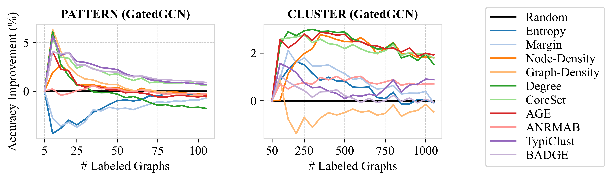

=====
ALINC
=====

This repository contains the official implementation for the paper
``ALINC: Active Learning for Inductive Node Classification via Graph Sampling`` 
by Plettenberg et al., accepted at ECML PKDD 2026.

ALINC is an active-learning framework for inductive node-classification
settings where datasets consist of many independent graphs and annotating one
node effectively requires annotating the full graph. It contains PyTorch
Geometric models, dataset loaders, graph transforms, evaluators, and graph-level
active-learning query strategies used in the paper's benchmark and case studies.

Features
========

* Training utilities for GCN, GIN/GINE, GAT/GATv2, GatedGCN, and GPS models.
* Dataset helpers for PATTERN, CLUSTER, PascalVOC-SP, COCO-SP, and Zaretzki.
* Active-learning strategies adapted for graph batches, including uncertainty,
  density, centrality, CoreSet, BADGE, AGE, ANRMAB, and TypiClust.
* Evaluation helpers for superpixel and Zaretzki-style multiclass metrics.

The active-learning code in ``src/dal_toolbox_graph``, including all graph
sampling strategies, builds on the `DAL Toolbox`_ by ``dhuseljic``.

.. _DAL Toolbox: https://github.com/dhuseljic/dal-toolbox

Installation
============

The project dependency files target Python 3.12 and CUDA 11.8. The supported
binary stack is PyTorch 2.7.x + CUDA 11.8, TorchVision 0.22.x, PyG 2.7 or
newer, and ``torch-scatter`` 2.1.2 or newer from the matching PyG CUDA 11.8
wheel index.

Create the environment with:

.. code-block:: bash

   conda env create -f environment.yml
   conda activate alinc-github

This creates the ``alinc-github`` conda environment and installs the package in
editable mode.

Alternatively, install into an existing Python 3.12 environment with:

.. code-block:: bash

   pip install -r requirements.txt

Both dependency files use bounded version ranges instead of exact pins, while
keeping the PyTorch and PyG package indexes fixed to CUDA 11.8 wheels.

Usage
=====

Training and active-learning runs are configured through the YAML files in
``scripts/configs``.

For example, run one of the graph-sampling benchmark settings from the paper:
BADGE with max aggregation on PascalVOC-SP using the GPS model.

.. code-block:: bash

   python scripts/train_al.py dataset=pascalvoc-sp model=gps_VOCSP_500k_toenshoff al=badge al.aggr_type=max

Other paper configurations can be run by changing the Hydra config groups, for
example ``al=coreset``, ``al=typiclust``, ``dataset=coco-sp``, or
``dataset=zaretzki``.

Citation
========

If you find this code useful, please cite:

.. code-block:: bibtex

   @inproceedings{plettenberg2026alinc,
     title = {ALINC: Active Learning for Inductive Node Classification via Graph Sampling},
     author = {Plettenberg, Pascal and Huseljic, Denis and Alcalde, Andr{\'e} and Sick, Bernhard and Thomas, Josephine M.},
     booktitle = {Joint European Conference on Machine Learning and Knowledge Discovery in Databases},
     year = {2026},
     organization = {Springer}
   }

Development
===========

Run the test suite from the repository root:

.. code-block:: bash

   conda activate alinc-github
   python -m pytest

Datasets, experiment outputs, and generated run artifacts are ignored by git via
``.gitignore``. Keep large raw data under ``data/`` and experiment outputs under
``experiments/`` or ``output/``.
